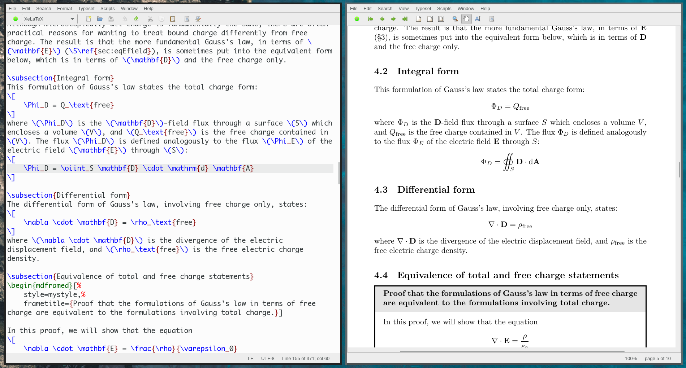

# `Open\HSR` LaTeX Workshop
This repository contains the documentation for the OpenHSR introductory LaTeX workshop.



Figure: Screenshot of TeXWorks under Linux with the sample document `samples/gauss-flux.tex`

## Goals
  - [ ] Install LaTeX on your machine (ideally in the PreLab, before the WS takes place)
  - [ ] Understand what is TeX, LaTeX, XeLaTeX, CTAN, etc.
  - [ ] Learn the basics of LaTeX to typeset
    - [ ] Text documents
    - [ ] Mathematics
    - [ ] Plots with pgfplots and
    - [ ] Diagrams and figures with Tikz
  - [ ] Understand compiler errors
  - [ ] Bibliography management
  - [ ] Create your own packages and classes
  - [ ] Integration with version control / Write collaboratively
    - [ ] Contribute to https://github.com/HSR-Stud !

    
## Pre-Lab
### Try LaTeX without installing

You're not really convinced? Give LaTeX a try using a free online editor. 
https://www.overleaf.com/project

### Install a TeX distribution

On the [Official Website](https://www.latex-project.org/get/#tex-distributions) of the LaTeX project there are always updated links to the various TeX Distributions. We recommend to pick one of these below depending on your operating system.

*Note:* **A full LaTeX distributions needs a few Gigabytes!** You should download and install this in advance before the seminar!
You *may* also install a minimal version (such as TinyTeX), but beware that you may be missing some packages. Though most TeX distributions come with a package manager that will allow you to download some packages later.

*Note for Linux users:* You should install texlive through your package manager.
If you are using a Debian / Ubuntu derivate the `texlive` package should install most of what you need.

*Note for Windows users:* The default MikTeX installation only contains the minimal number of packages. MikTeX then offers a package management system to automatically downlad the missing packages as needed, but that means that your first document will take forever to compile. Be patient.

| Distrubition | OS      | Homepage                              |
|--------------|---------|---------------------------------------|
| TeX Live     | Linux   | https://www.tug.org/texlive/          |
| MacTeX       | MacOS   | https://www.tug.org/mactex/index.html |
| MikTeX       | Windows | https://miktex.org/                   |
| TinyTex (are you feeling adventurous?) | Linux, MacOS, Windows | https://yihui.org/tinytex/            |

### Get a (La)TeX editor

If you don't know which one to pick, TeXWorks is probably the simplest.

*Note:* Your TeX distribution may already include an editor (for ex. TeXShop for MacTeX).

| Name      | Supported OSs       | Homepage                          |
|-----------|---------------------|-----------------------------------|
| TeXWorks  | Linux, Mac, Windows | https://www.tug.org/texworks/     |
| TexMaker  | Linux, Mac, Windows | https://www.xm1math.net/texmaker/ |
| TeXStudio | Linux, Mac, Windows | https://www.texstudio.org/        |
| Overleaf  | Firefox, Chrome (online!) | https://www.overleaf.com/         |

Here is a (pretty old, but still relevant) comparison of various editors:
https://tex.stackexchange.com/questions/339/latex-editors-ides

## Further readings and useful links
- [Wikibooks LaTeX (online)](https://en.wikibooks.org/wiki/LaTeX#Contents)
- [Introduction to LaTeX (online)](https://web.mit.edu/rsi/www/pdfs/new-latex.pdf)
- [A not so short introduction to LaTeXe](references/lshort.pdf) ([online](https://tobi.oetiker.ch/lshort/lshort.pdf))
- [Detexify LaTeX handwritten symbols recognition (online)](http://detexify.kirelabs.org/classify.html)
- [LaTeX Mathematical Symbols (compact)](references/symbols-compact.pdf) ([online](https://www.caam.rice.edu/~heinken/latex/symbols.pdf))
- [A comprehensive LaTeX Symbol List](references/symbols-a4.pdf) ([online](http://tug.ctan.org/info/symbols/comprehensive/symbols-a4.pdf))
- [The LaTeX Font Catalogue (online)](https://www.tug.org/FontCatalogue/)
- *Advanced!* [Graphics in LaTeX using TikZ (online)](https://www.tug.org/TUGboat/tb29-1/tb91walczak.pdf)
- *Advanced!* [A very minimal introduction to TikZ (online)](http://cremeronline.com/LaTeX/minimaltikz.pdf)
- *Advanced!* [CTAN Topic TikZ (online)](https://www.ctan.org/topic/pgf-tikz)
- *Advanced!* [Manual for PGF and TikZ (online)](http://mirror.easyname.at/ctan/graphics/pgf/base/doc/pgfmanual.pdf)
- *Advanced!* [Manual for Package PGFPLOTS (online)](http://mirror.easyname.at/ctan/graphics/pgf/contrib/pgfplots/doc/pgfplots.pdf)
- *Advanced!* [Building a new LATEX document class is illustrated by developing a class forminutes of meetings (online)](http://tutex.tug.org/pracjourn/2005-4/hefferon/hefferon.pdf)
- *Advanced!* [LaTeXe for class and package writers](references/clsguide.pdf) ([online](https://www.latex-project.org/help/documentation/clsguide.pdf))

## License
```
Open\HSR-LaTeX-Workshop (c) by Naoki Pross

Open\HSR-LaTeX-Workshop is licensed under a
Creative Commons Attribution-ShareAlike 4.0 Unported License.

You should have received a copy of the license along with this
work.  If not, see <http://creativecommons.org/licenses/by-sa/4.0/>.
```
